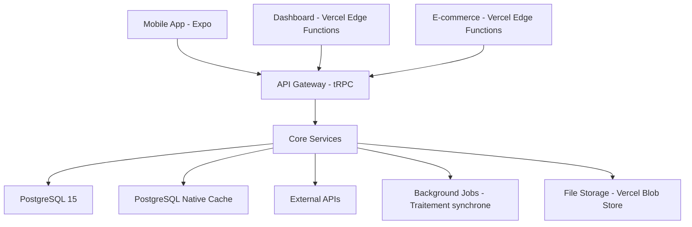

# 🔧 Architecture Technique

Cette section contient l'architecture système, stack technique, sécurité et infrastructure de Make the CHANGE.

## 📋 Contenu de cette Section

Documentation technique complète couvrant architecture, stack, database, API design et infrastructure.

## 🗂️ Documents

| Document | Description | Status | Dernière MAJ |
|----------|-------------|--------|--------------|
| [architecture-overview.md](./architecture-overview.md) | Vue d'ensemble système complet | ✅ Final | 2025-08-22 |
| [tech-stack.md](./tech-stack.md) | Stack détaillée et justifications | ✅ Final | 2025-08-22 |
| [database-schema.md](./database-schema.md) | PostgreSQL schema complet | ✅ Final | 2025-08-22 |
| [api-design.md](./api-design.md) | tRPC routes et structure | 📋 À créer | - |
| [security.md](./security.md) | Sécurité, auth, encryption | 📋 À créer | - |
| [performance.md](./performance.md) | Optimisations et cibles | 📋 À créer | - |
| **infrastructure/** | Infrastructure et déploiement | | |
| [infrastructure/deployment.md](./infrastructure/deployment.md) | CI/CD, environments | ✅ Final | 2025-08-22 |
| [infrastructure/monitoring.md](./infrastructure/monitoring.md) | Logs, metrics, alerting | 📋 À créer | - |
| [infrastructure/backup-recovery.md](./infrastructure/backup-recovery.md) | Stratégies backup | 📋 À créer | - |
| [infrastructure/scaling.md](./infrastructure/scaling.md) | Plans de scalabilité | 📋 À créer | - |
| **~~integrations/~~** | ~~Intégrations externes~~ | ❌ Supprimé | *Intégrations documentées dans architecture-overview.md* |

## 🚀 Stack Technique 2025

### Architecture Monorepo
```
Turborepo v2 + pnpm workspaces
├── apps/mobile/     # Expo SDK 53 + React Native
├── apps/web/        # Vercel Edge Functions 15 + React 19  
├── apps/api/        # tRPC v11 + Vercel Edge Functions
└── packages/shared/ # Types, utils, components
```

### Core Technologies

#### Frontend
- **Mobile** : Expo SDK 53 + TypeScript 5.7+
- **Web** : Vercel Edge Functions 15 + React 19 + shadcn/ui v2
- **Styling** : Tailwind CSS v4 + NativeWind v4
- **State** : TanStack Query v5 + Zustand

#### Backend  
- **Runtime** : Vercel Edge Functions + TypeScript 5.7+
- **API** : tRPC v11 (type-safe end-to-end)
- **Database** : Supabase Free Tier (PostgreSQL 15)
- **Cache** : PostgreSQL natif (materialized views)
- **Auth** : Supabase Auth

#### Infrastructure
- **Deployment** : Vercel Edge Functions (full-stack)
- **Storage** : Vercel Blob Store (1GB gratuit)
- **Monitoring** : Vercel Analytics gratuit
- **CI/CD** : GitHub Actions

## 🏗️ Architecture Système



## 🔐 Services Architecture

```typescript
interface CoreServices {
  auth: AuthService;           // Supabase Auth v5 integration
  investment: InvestmentService; // Gestion investissements + calculs
  production: ProductionService; // Tracking production ruches/oliviers
  points: PointsService;        // Système de points + expiry
  ecommerce: ECommerceService;  // Catalogue + commandes + fulfillment
  notification: NotificationService; // Push + email + SMS
  geolocation: GeoService;     // Cartes + localisation projects
  analytics: AnalyticsService;  // Métriques business + KPIs
  payment: PaymentService;     // Stripe integration + KYC
}
```

## 📊 Performance Targets

### API Performance
- **Response P95** : <200ms
- **Uptime** : >99.9%
- **Throughput** : 1000 RPS

### Frontend Performance  
- **Mobile cold start** : <2s
- **Time to interactive** : <3s
- **Core Web Vitals** : All Green
- **Bundle size** : <2MB

## 🔗 Liens Connexes

- [💼 01-Strategy](../01-strategy/) - Business requirements
- [📱 04-Specifications](../04-specifications/) - Implementation specs
- [💻 06-Development](../06-development/) - Development guides
- [📦 05-Operations](../05-operations/) - Operational procedures

## 🛠️ Outils de Développement

### Development
- **IDE** : VS Code + Extensions pack
- **Linting** : ESLint + Prettier + TypeScript strict
- **Testing** : Vitest + Playwright + Testing Library
- **Git** : Conventional commits + Husky hooks

### Monitoring & Debug
- **Logs** : Sentry + Console aggregation
- **Performance** : Lighthouse + Web Vitals
- **Database** : Prisma Studio + pgAdmin
- **API** : tRPC panel + Postman

---
*Section maintenue par : Dev Team | Dernière révision : 2025-01-XX*