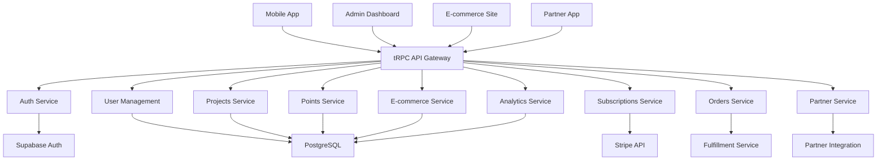

# Backend Requirements Analysis - Make the CHANGE

**📅 Date:** 2025-01-XX | **📊 Status:** Analysis Complete | **🎯 Next:** API Specifications

## 🔍 Analyse des Spécifications Frontend

Après analyse exhaustive de `/docs/04-specifications/`, voici la **cartographie complète** des fonctionnalités backend requises pour supporter le frontend mobile, admin et e-commerce.

## 📊 Vue d'Ensemble des Besoins

### 🏗️ Architecture Backend Requise



## 🎯 1. Authentication & User Management

### Frontend Requirements Analysis
**Sources:** 
- `/mobile-app/mvp/auth/register.md` 
- `/mobile-app/mvp/auth/login.md`
- `/admin-dashboard/mvp/auth/auth.md`

### Backend APIs Requis

#### 1.1 Authentication Endpoints
```typescript
interface AuthAPI {
  // Registration avec dual billing choice
  register: {
    input: {
      email: string
      password: string
      firstName: string
      lastName: string
      acceptedTerms: boolean
      billingFrequency: 'monthly' | 'annual' // NOUVEAU
      subscriptionTier?: 'ambassadeur_standard' | 'ambassadeur_premium'
    }
    output: {
      user: User
      session: Session
      stripeCustomer: StripeCustomer // NOUVEAU pour billing
    }
  }

  login: {
    input: { email: string; password: string }
    output: { user: User; session: Session }
  }

  logout: {
    input: { sessionId: string }
    output: { success: boolean }
  }

  refreshToken: {
    input: { refreshToken: string }
    output: { accessToken: string; refreshToken: string }
  }

  validateEmail: {
    input: { email: string }
    output: { valid: boolean; available: boolean; suggestions?: string[] }
  }

  resetPassword: {
    input: { email: string }
    output: { success: boolean }
  }
}
```

#### 1.2 User Management Service
```typescript
interface UserService {
  // Profile management
  getCurrentUser(): Promise<UserWithProfile>
  updateProfile(updates: Partial<UserProfile>): Promise<User>
  updatePreferences(preferences: UserPreferences): Promise<User>
  
  // Level progression (Explorateur → Protecteur → Ambassadeur)
  checkLevelProgression(userId: string): Promise<LevelProgression>
  upgradeUserLevel(userId: string, newLevel: UserLevel): Promise<User>
  
  // KYC Integration avec Stripe Identity
  initiateKYC(userId: string, level: 'light' | 'complete'): Promise<StripeVerificationSession>
  processKYCResult(sessionId: string): Promise<KYCResult>
  
  // Address management
  getUserAddresses(userId: string): Promise<Address[]>
  saveAddress(userId: string, address: Address): Promise<Address>
  deleteAddress(userId: string, addressId: string): Promise<boolean>
}
```

### Business Logic Critical
- **Dual Billing Choice** lors registration (monthly vs annual)
- **Level Progression** automatique basée sur investissements
- **KYC Thresholds** : €100 (light), €1000 (complete)
- **Session Management** : Refresh tokens, device tracking

## 🎯 2. Projects & Investments System

### Frontend Requirements Analysis
**Sources:**
- `/mobile-app/mvp/navigation/dashboard.md` - Dashboard adaptatif par niveau
- `/mobile-app/mvp/flows/project-detail.md` - Detail projet + CTA investissement  
- `/admin-dashboard/mvp/projects/projects.md` - CRUD projets complet

### Backend APIs Requis

#### 2.1 Projects API (Public + Admin)
```typescript
interface ProjectsAPI {
  // Public endpoints (consommés par mobile)
  getPublicProjects: {
    input: {
      filters?: {
        type?: 'beehive' | 'olive_tree' | 'vineyard'
        location?: { lat: number; lng: number; radius: number }
        status?: 'active' | 'funded'
        featured?: boolean
      }
      pagination: { page: number; limit: number }
      sort?: 'created_at' | 'funding_progress' | 'supporters_count'
    }
    output: {
      projects: PublicProject[]
      total: number
      filters: AvailableFilters
    }
  }

  getProjectDetail: {
    input: { slug: string }
    output: {
      project: ProjectDetail
      producer: Producer
      updates: ProjectUpdate[]
      investmentOptions: InvestmentOption[]
    }
  }

  // Admin endpoints
  createProject: {
    input: {
      basic_info: {
        name: string
        type: ProjectType
        short_description: string
        long_description: string
      }
      location: {
        coordinates: [number, number]
        address: Address
      }
      partner_info: {
        partner_id: string
        certifications: string[]
      }
      funding: {
        target_amount: number
        funding_deadline?: Date
      }
      media: {
        hero_image: string
        gallery: string[]
      }
    }
    output: { project: Project }
  }

  updateProject: {
    input: { id: string; updates: Partial<ProjectEditor> }
    output: { project: Project }
  }

  changeProjectStatus: {
    input: { 
      id: string
      status: ProjectStatus
      reason?: string
    }
    output: { 
      project: Project
      webhook_sent: boolean // Notification partenaire
    }
  }
}
```

#### 2.2 Investments Service
```typescript
interface InvestmentsService {
  // Investment creation avec Stripe
  createInvestment: {
    input: {
      projectId: string
      investmentType: 'ruche' | 'olivier' | 'parcelle_familiale'
      amount: 50 | 80 | 150 // Prix fixes
      paymentMethodId: string // Stripe Payment Method
    }
    output: {
      investment: Investment
      pointsGenerated: number
      paymentIntent: StripePaymentIntent
      trackingIds: string[] // IDs spécifiques ruches/oliviers
    }
  }

  getUserInvestments: {
    input: {
      userId: string
      status?: 'active' | 'completed' | 'cancelled'
      pagination: Pagination
    }
    output: {
      investments: InvestmentWithProject[]
      analytics: InvestmentAnalytics
    }
  }

  getInvestmentDetail: {
    input: { investmentId: string }
    output: {
      investment: InvestmentDetail
      project: Project
      producer: Producer
      updates: ProjectUpdate[]
      impactMetrics: ImpactMetrics
    }
  }
}
```

### Business Logic Critical
- **Prix fixes par type** : 50€ ruche, 80€ olivier, 150€ parcelle
- **Bonus points** : 30%, 40%, 50% selon type
- **Tracking IDs** génération automatique lors funding
- **Workflow states** : draft → active → funded → completed
- **Partner notifications** via webhooks

## 🎯 3. Dual Billing Subscriptions System

### Frontend Requirements Analysis
**Sources:**
- `/mobile-app/mvp/auth/register.md` - Choice billing frequency
- `/mobile-app/mvp/navigation/dashboard.md` - Monthly→Annual upgrade prompts
- `/admin-dashboard/mvp/users/users.md` - Subscription management

### Backend APIs Requis

#### 3.1 Subscriptions API
```typescript
interface SubscriptionsAPI {
  // Subscription creation avec Stripe dual billing
  createSubscription: {
    input: {
      userId: string
      tier: 'ambassadeur_standard' | 'ambassadeur_premium'
      billingFrequency: 'monthly' | 'annual'
      paymentMethodId: string
      projectAllocation?: ProjectAllocation[] // Allocation flexible
    }
    output: {
      subscription: Subscription
      stripeSubscription?: StripeSubscription // Si monthly
      paymentIntent?: StripePaymentIntent // Si annual
      pointsGenerated: number
    }
  }

  // Changement billing frequency (monthly ↔ annual)
  changeBillingFrequency: {
    input: {
      subscriptionId: string
      newFrequency: 'monthly' | 'annual'
      prorationHandling: 'immediate' | 'next_cycle'
    }
    output: {
      subscription: Subscription
      proration: ProrationDetails
      pointsAdjustment: number
    }
  }

  // Upgrade/downgrade tiers
  updateSubscriptionTier: {
    input: {
      subscriptionId: string
      newTier: SubscriptionTier
      effectiveDate: 'immediate' | 'next_cycle'
    }
    output: {
      subscription: Subscription
      proration: ProrationDetails
    }
  }

  // Stripe Customer Portal pour self-service
  createBillingPortalSession: {
    input: { customerId: string; returnUrl: string }
    output: { portalUrl: string }
  }
}
```

#### 3.2 Billing Service Critical
```typescript
interface BillingService {
  // Webhooks Stripe handlers
  handleSubscriptionInvoicePayment(invoice: StripeInvoice): Promise<void>
  handleAnnualPaymentSuccess(paymentIntent: StripePaymentIntent): Promise<void>
  handlePaymentFailure(event: StripeEvent): Promise<void>
  
  // MRR Analytics
  calculateMRR(period: DateRange): Promise<MRRMetrics>
  getSubscriptionAnalytics(filters: AnalyticsFilters): Promise<SubscriptionAnalytics>
  
  // Billing frequency conversion tracking
  trackFrequencyChanges(): Promise<ConversionMetrics>
}
```

### Business Logic Critical  
- **Dual billing model** : Stripe Subscriptions (monthly) + Payment Intents (annual)
- **Conversion incentives** : 17% discount annual, upgrade prompts
- **Proration logic** : Credit/debit lors changements
- **Points generation** : Différent selon tier et frequency
- **Self-service** : Stripe Customer Portal integration

## 🎯 4. Points Economy System

### Frontend Requirements Analysis
**Sources:**
- `/mobile-app/mvp/navigation/dashboard.md` - Points balance, expiry warnings
- `/mobile-app/mvp/navigation/rewards.md` - Catalogue et échange points
- `/admin-dashboard/mvp/users/points.md` - Points management admin

### Backend APIs Requis

#### 4.1 Points API
```typescript
interface PointsAPI {
  // User points operations
  getPointsBalance: {
    input: { userId: string }
    output: {
      currentBalance: number
      earnedTotal: number
      spentTotal: number
      expiringPoints: ExpiringPoints[]
      projectedEarnings: ProjectedPoints[]
    }
  }

  getPointsHistory: {
    input: {
      userId: string
      type?: 'earned' | 'spent' | 'expired' | 'bonus'
      pagination: Pagination
    }
    output: {
      transactions: PointsTransaction[]
      summary: PointsSummary
    }
  }

  // Points generation (internal)
  generatePointsFromInvestment: {
    input: {
      userId: string
      investmentId: string
      baseAmount: number
      bonusPercentage: number
    }
    output: {
      transaction: PointsTransaction
      expiryDate: Date
      newBalance: number
    }
  }

  generatePointsFromSubscription: {
    input: {
      userId: string
      subscriptionId: string  
      period: BillingPeriod
      tier: SubscriptionTier
    }
    output: {
      transaction: PointsTransaction
      expiryDate: Date
      newBalance: number
    }
  }

  // Points expiry management
  getExpiringPoints: {
    input: { userId: string; daysAhead: number }
    output: { expiringPoints: ExpiringPoints[] }
  }

  processPointsExpiry: {
    input: { userId: string }
    output: { expiredAmount: number; notificationSent: boolean }
  }

  // Admin points operations
  adjustPoints: {
    input: {
      userId: string
      amount: number // positif ou négatif
      reason: string
      adminId: string
    }
    output: { transaction: PointsTransaction }
  }
}
```

#### 4.2 Points Service Critical
```typescript
interface PointsService {
  // Core business logic
  calculateInvestmentPoints(amount: number, type: InvestmentType): Promise<PointsCalculation>
  calculateSubscriptionPoints(tier: SubscriptionTier, frequency: BillingFrequency): Promise<PointsCalculation>
  
  // Expiry management
  schedulePointsExpiry(transaction: PointsTransaction): Promise<ExpirySchedule>
  sendExpiryWarnings(): Promise<NotificationResults>
  processExpiredPoints(): Promise<ExpiryResults>
  
  // Balance management
  debitPoints(userId: string, amount: number, orderId: string): Promise<PointsTransaction>
  refundPoints(userId: string, originalTransaction: string): Promise<PointsTransaction>
  
  // Analytics
  getPointsEconomyMetrics(): Promise<PointsEconomyAnalytics>
}
```

### Business Logic Critical
- **Expiry management** : 18 mois après génération
- **Notifications** : 60j, 30j, 7j avant expiry
- **Transaction types** : earned, spent, expired, bonus, adjustment
- **Balance calculation** : Temps réel avec triggers PostgreSQL
- **Audit trail** : Toutes transactions tracées

## 🎯 5. E-commerce & Orders System

### Frontend Requirements Analysis
**Sources:**
- `/mobile-app/mvp/navigation/rewards.md` - Catalogue produits
- `/ecommerce-site/mvp/checkout/checkout.md` - Checkout process complet
- `/admin-dashboard/mvp/orders/orders.md` - Order management system

### Backend APIs Requis

#### 5.1 Products API
```typescript
interface ProductsAPI {
  // Public catalog
  getProducts: {
    input: {
      filters?: {
        category?: string
        producer?: string
        pointsRange?: [number, number]
        inStock?: boolean
        userLevel?: UserLevel // Filtrage par niveau requis
      }
      search?: string
      pagination: Pagination
      sort?: 'price' | 'popularity' | 'newest'
    }
    output: {
      products: Product[]
      categories: Category[]
      filters: AvailableFilters
    }
  }

  getProductDetail: {
    input: { slug: string }
    output: {
      product: ProductDetail
      producer: Producer
      relatedProducts: Product[]
      reviews: ProductReview[]
      stock: StockInfo
    }
  }

  // Admin CRUD
  createProduct: {
    input: {
      name: string
      category_id: string
      producer_id: string
      price_points: number
      fulfillment_method: 'stock' | 'dropship'
      is_hero_product: boolean
      description: string
      images: string[]
      stock_quantity?: number // Si fulfillment_method = 'stock'
      min_tier: UserLevel
    }
    output: { product: Product }
  }

  updateProduct: {
    input: { id: string; updates: Partial<ProductEditor> }
    output: { product: Product }
  }

  // Inventory management (héros products)
  updateStock: {
    input: {
      productId: string
      quantity: number
      movement_type: 'in' | 'out' | 'adjustment'
      reason: string
    }
    output: {
      inventory: InventoryRecord
      alerts: StockAlert[]
    }
  }
}
```

#### 5.2 Orders API  
```typescript
interface OrdersAPI {
  // Cart management
  addToCart: {
    input: { userId: string; productId: string; quantity: number }
    output: { cartItem: CartItem; totalPoints: number }
  }

  getCart: {
    input: { userId: string }
    output: {
      items: CartItem[]
      total: number
      pointsRequired: number
      userBalance: number
      canCheckout: boolean
    }
  }

  // Order creation
  createOrder: {
    input: {
      userId: string
      items: OrderItemInput[]
      shippingAddress: Address
      deliveryInstructions?: string
      deliverySlot?: string
    }
    output: {
      order: Order
      pointsDebited: number
      fulfillmentRoute: FulfillmentRoute
    }
  }

  // Order management (Admin)
  getOrders: {
    input: {
      filters: OrderFilters
      pagination: Pagination
    }
    output: {
      orders: OrderWithItems[]
      summary: OrdersSummary
    }
  }

  updateOrderStatus: {
    input: {
      orderId: string
      status: OrderStatus
      trackingNumber?: string
      note?: string
      notifyCustomer: boolean
    }
    output: {
      order: Order
      notificationSent: boolean
    }
  }

  // Fulfillment hybride
  processHybridFulfillment: {
    input: { orderId: string }
    output: {
      stockItems: FulfillmentItem[] // Expédition micro-hub
      dropshipItems: FulfillmentItem[] // Expédition partenaires
      shipments: Shipment[]
    }
  }
}
```

#### 5.3 Fulfillment Service Critical
```typescript
interface FulfillmentService {
  // Routing intelligent stock vs dropship
  routeOrder(order: Order): Promise<FulfillmentRoute>
  
  // Stock management micro-hub
  reserveStock(productId: string, quantity: number): Promise<StockReservation>
  releaseStock(reservationId: string): Promise<void>
  checkStockLevels(): Promise<StockAlert[]>
  
  // Partner integration
  sendDropshipOrder(partnerId: string, orderItems: OrderItem[]): Promise<PartnerShipment>
  trackPartnerShipment(shipmentId: string): Promise<TrackingInfo>
  
  // Shipping
  generateShippingLabel(shipment: Shipment): Promise<ShippingLabel>
  calculateShippingCost(items: OrderItem[], address: Address): Promise<ShippingCost>
}
```

### Business Logic Critical
- **Fulfillment hybride** : Stock MTC (2-3 SKUs) + Dropshipping partenaires
- **Points debit** : Instantané lors commande, refund si annulation
- **Stock reservation** : Lors ajout panier, release après 30min
- **Order workflow** : pending → confirmed → preparing → shipped → delivered
- **Shipping zones** : France, Belgique, Luxembourg, Suisse

## 🎯 6. Partner Integration & Partner App

### Frontend Requirements Analysis
**Sources:**
- `/mobile-app/mvp/partner-app/README.md` - App native partenaires
- `/admin-dashboard/mvp/projects/partners.md` - Partner management
- `/admin-dashboard/v1/integrations/webhooks.md` - Webhooks partenaires

### Backend APIs Requis

#### 6.1 Partner API
```typescript
interface PartnerAPI {
  // Partner management (Admin)
  getPartners: {
    input: { filters: PartnerFilters; pagination: Pagination }
    output: { partners: Partner[]; metrics: PartnerMetrics[] }
  }

  createPartner: {
    input: {
      name: string
      type: 'beekeeper' | 'olive_grower' | 'winery'
      location: Location
      contact_info: ContactInfo
      commission_rate: number
      certifications: string[]
    }
    output: { partner: Partner }
  }

  // Partner App authentication
  partnerLogin: {
    input: { email: string; password: string }
    output: { partnerUser: PartnerUser; session: PartnerSession }
  }

  // Project updates par partenaires
  createProjectUpdate: {
    input: {
      projectId: string
      authorId: string // partner_user_id
      title: string
      description: string
      media_urls: string[]
      update_type: 'milestone' | 'routine' | 'event'
    }
    output: {
      update: ProjectUpdate
      moderation_required: boolean
    }
  }

  moderateUpdate: {
    input: {
      updateId: string
      status: 'approved' | 'rejected'
      moderatorId: string
      notes?: string
    }
    output: { update: ProjectUpdate }
  }

  // Webhook management
  sendPartnerWebhook: {
    input: {
      partnerId: string
      event: 'project_funded' | 'production_milestone' | 'order_received'
      data: WebhookPayload
    }
    output: { success: boolean; response: WebhookResponse }
  }
}
```

#### 6.2 Partner Service Critical
```typescript
interface PartnerService {
  // Commission management
  calculateCommission(orderId: string, partnerId: string): Promise<CommissionCalculation>
  processPartnerPayouts(): Promise<PayoutResults>
  
  // Production tracking
  syncProductionData(partnerId: string, data: ProductionData): Promise<SyncResult>
  generatePartnerReport(partnerId: string, period: DateRange): Promise<PartnerReport>
  
  // Webhook reliability
  retryFailedWebhooks(): Promise<RetryResults>
  logWebhookDelivery(webhookId: string, response: WebhookResponse): Promise<void>
  
  // Partner App media upload
  processPartnerMedia(files: File[], projectId: string): Promise<MediaUploadResult[]>
  moderatePartnerContent(contentId: string): Promise<ModerationResult>
}
```

### Business Logic Critical
- **Commission rates** : 15-22% selon partenaire et volume
- **Updates moderation** : Approval workflow avant publication
- **Media upload** : S3/Vercel Blob avec resizing automatique
- **Webhook reliability** : Retry logic avec exponential backoff
- **Partner app roles** : Owner vs Staff permissions

## 🎯 7. Analytics & Reporting System

### Frontend Requirements Analysis
**Sources:**
- `/admin-dashboard/mvp/projects/dashboard.md` - Project analytics
- `/admin-dashboard/v1/analytics/business-intel.md` - Business metrics
- `/mobile-app/mvp/navigation/dashboard.md` - User-specific analytics

### Backend APIs Requis

#### 7.1 Analytics API
```typescript
interface AnalyticsAPI {
  // Business metrics
  getBusinessMetrics: {
    input: { period: DateRange; metrics: BusinessMetric[] }
    output: {
      mrr: MRRData
      userGrowth: UserGrowthData
      investmentMetrics: InvestmentMetrics
      pointsEconomy: PointsEconomyMetrics
      conversionRates: ConversionMetrics
    }
  }

  // User analytics
  getUserAnalytics: {
    input: { userId: string; period: DateRange }
    output: {
      investmentPerformance: InvestmentAnalytics
      pointsUtilization: PointsAnalytics
      engagementMetrics: EngagementMetrics
      progressionPath: UserProgressionData
    }
  }

  // Project analytics  
  getProjectAnalytics: {
    input: { projectId: string }
    output: {
      fundingProgress: FundingAnalytics
      supporterEngagement: EngagementAnalytics
      impactMetrics: ImpactAnalytics
      partnerPerformance: PartnerAnalytics
    }
  }

  // Cohort analysis
  getCohortAnalytics: {
    input: { cohortType: 'monthly' | 'quarterly'; metric: 'retention' | 'ltv' }
    output: { cohorts: CohortData[] }
  }
}
```

#### 7.2 Reporting Service Critical
```typescript
interface ReportingService {
  // Automated reports
  generateDailyReport(): Promise<DailyReport>
  generateWeeklyReport(): Promise<WeeklyReport>
  generateMonthlyReport(): Promise<MonthlyReport>
  
  // Custom reports
  createCustomReport(config: ReportConfig): Promise<CustomReport>
  scheduleReport(reportId: string, schedule: CronSchedule): Promise<ScheduledReport>
  
  // Real-time metrics
  getRealtimeMetrics(): Promise<RealtimeMetrics>
  trackEvent(event: AnalyticsEvent): Promise<void>
  
  // Export capabilities
  exportAnalytics(format: 'csv' | 'xlsx' | 'pdf', config: ExportConfig): Promise<ExportResult>
}
```

## 🎯 8. Notifications & Communication

### Frontend Requirements Analysis
**Sources:**
- `/mobile-app/mvp/components/push-notification-system.md` - Push notifications
- `/admin-dashboard/v1/automation/notifications.md` - Notification management
- Points expiry warnings, order updates, project milestones

### Backend APIs Requis

#### 8.1 Notifications API
```typescript
interface NotificationsAPI {
  // Push notifications (mobile)
  sendPushNotification: {
    input: {
      userId: string
      title: string
      body: string
      data?: Record<string, any>
      deepLink?: string
    }
    output: { success: boolean; messageId: string }
  }

  // Email notifications
  sendEmail: {
    input: {
      to: string
      template: EmailTemplate
      variables: Record<string, any>
      priority: 'low' | 'normal' | 'high'
    }
    output: { success: boolean; messageId: string }
  }

  // Bulk notifications
  sendBulkNotification: {
    input: {
      userIds: string[]
      notification: NotificationPayload
      scheduling?: ScheduleConfig
    }
    output: { 
      queued: number
      failed: string[]
      estimatedDelivery: Date
    }
  }

  // User preferences
  getNotificationPreferences: {
    input: { userId: string }
    output: { preferences: NotificationPreferences }
  }

  updateNotificationPreferences: {
    input: { userId: string; preferences: Partial<NotificationPreferences> }
    output: { preferences: NotificationPreferences }
  }
}
```

#### 8.2 Communication Service Critical
```typescript
interface CommunicationService {
  // Automated notifications
  sendPointsExpiryWarnings(): Promise<NotificationResults>
  sendOrderStatusUpdates(): Promise<NotificationResults>
  sendProjectMilestoneUpdates(): Promise<NotificationResults>
  sendSubscriptionRenewalReminders(): Promise<NotificationResults>
  
  // Template management
  renderEmailTemplate(template: EmailTemplate, variables: TemplateVariables): Promise<RenderedEmail>
  A/BTestTemplate(templateIds: string[], userIds: string[]): Promise<ABTestResults>
  
  // Delivery tracking
  trackNotificationDelivery(messageId: string): Promise<DeliveryStatus>
  getNotificationAnalytics(period: DateRange): Promise<NotificationAnalytics>
  
  // Compliance
  handleUnsubscribe(userId: string, type: NotificationType): Promise<void>
  processPrivacyRequest(userId: string, request: PrivacyRequest): Promise<PrivacyResponse>
}
```

## 📋 Plan d'Implémentation Backend

### 🏗️ Structure des Spécifications Backend à Créer

```
docs/03-technical/
├── api/                              # API Endpoints détaillés
│   ├── auth-endpoints.md            # ✅ Authentication complète
│   ├── users-endpoints.md           # ✅ User management + KYC
│   ├── projects-endpoints.md        # ✅ Projects CRUD + public API
│   ├── investments-endpoints.md     # ✅ Investment flow + Stripe
│   ├── subscriptions-endpoints.md   # ✅ Dual billing + Stripe
│   ├── points-endpoints.md          # ✅ Points economy + expiry
│   ├── products-endpoints.md        # ✅ E-commerce catalog + inventory
│   ├── orders-endpoints.md          # ✅ Order management + fulfillment
│   ├── partners-endpoints.md        # ✅ Partner API + webhooks
│   ├── analytics-endpoints.md       # ✅ Analytics + reporting
│   └── notifications-endpoints.md   # ✅ Communications + preferences
│
├── services/                        # Business Logic Services
│   ├── auth-service.md             # ✅ Auth flows + session management
│   ├── billing-service.md          # ✅ Stripe dual billing logic
│   ├── points-service.md           # ✅ Points calculation + expiry
│   ├── fulfillment-service.md      # ✅ Hybrid fulfillment logic
│   ├── partner-service.md          # ✅ Partner integration + webhooks
│   ├── analytics-service.md        # ✅ Metrics calculation + reporting
│   └── notification-service.md     # ✅ Communication + templates
│
├── integrations/                    # External Integrations
│   ├── stripe-integration.md       # ✅ Webhooks + dual billing
│   ├── supabase-integration.md     # ✅ Auth + database + storage
│   ├── vercel-integration.md       # ✅ Edge functions + blob storage
│   └── partner-webhooks.md         # ✅ Partner API contracts
│
├── schemas/                         # Data Schemas & Validation
│   ├── zod-schemas.md              # ✅ Input/output validation
│   ├── database-types.md           # ✅ PostgreSQL types + constraints
│   └── api-contracts.md            # ✅ tRPC type safety contracts
│
└── workflows/                       # Business Workflows
    ├── user-registration.md        # ✅ Registration + billing choice
    ├── investment-flow.md           # ✅ Investment + points generation
    ├── order-fulfillment.md        # ✅ Hybrid fulfillment process
    ├── points-expiry.md            # ✅ Expiry management + notifications
    └── partner-onboarding.md       # ✅ Partner integration workflow
```

### 🎯 Priorités d'Implémentation (20 Semaines)

#### **Semaines 1-4 : Authentication & Core Services**
1. `auth-service.md` + `auth-endpoints.md`
2. `users-endpoints.md` avec KYC Stripe
3. `billing-service.md` + `subscriptions-endpoints.md` (DUAL BILLING)
4. `zod-schemas.md` (validation complète)

#### **Semaines 5-8 : Projects & Investments** 
1. `projects-endpoints.md` (public + admin)
2. `investments-endpoints.md` + Stripe integration
3. `points-service.md` + `points-endpoints.md`
4. `partner-service.md` + webhooks

#### **Semaines 9-12 : E-commerce & Orders**
1. `products-endpoints.md` + inventory
2. `orders-endpoints.md` + fulfillment
3. `fulfillment-service.md` (hybride critical)
4. Partner app API

#### **Semaines 13-16 : Analytics & Notifications**
1. `analytics-endpoints.md` + service
2. `notification-service.md` + templates
3. `partner-webhooks.md` + reliability
4. Reporting system

#### **Semaines 17-20 : Integration & Testing**
1. `stripe-integration.md` (webhooks + error handling)
2. `api-contracts.md` (type safety end-to-end) 
3. Error handling + recovery workflows
4. Performance optimization + caching

## ⚠️ Risques Identifiés

### 🚨 Risques Critiques
1. **Stripe Dual Billing Complexity** - Monthly vs Annual logic
2. **Points Expiry Management** - 18 mois tracking + notifications
3. **Hybrid Fulfillment** - Stock MTC + Partner dropshipping
4. **Partner Webhook Reliability** - Retry logic + failure handling
5. **Real-time Analytics** - Performance avec croissance utilisateurs

### 🛡️ Mitigations
- **Extensive Testing** : Stripe webhooks, points calculations
- **Monitoring** : Real-time alerts sur erreurs critiques  
- **Backup Workflows** : Fallback manuel si automation fails
- **Rate Limiting** : Protection contre abuse API
- **Data Validation** : Zod schemas + PostgreSQL constraints

## 📊 Métriques de Succès

### 🎯 KPIs Techniques
- **API Response Time** : P95 <200ms
- **Error Rate** : <0.1% sur endpoints critiques
- **Webhook Reliability** : >99.5% delivery success
- **Points Accuracy** : 100% balance calculations correctes
- **Billing Accuracy** : 0 erreurs dual billing

### 📈 KPIs Business
- **Registration Conversion** : >35% avec billing choice
- **Monthly→Annual Conversion** : >15% après 3 mois
- **Points Utilization** : >60% des points générés utilisés
- **Order Fulfillment** : <24h processing time moyenne
- **Partner Satisfaction** : >90% webhook delivery success

---

**🎯 CONCLUSION** : L'analyse révèle une architecture backend complexe mais bien définie. Le dual billing, le système de points avec expiry, et le fulfillment hybride sont les défis techniques majeurs nécessitant une attention particulière lors de l'implémentation.

**➡️ NEXT STEPS** : Création des spécifications API détaillées selon le plan d'implémentation 20 semaines.