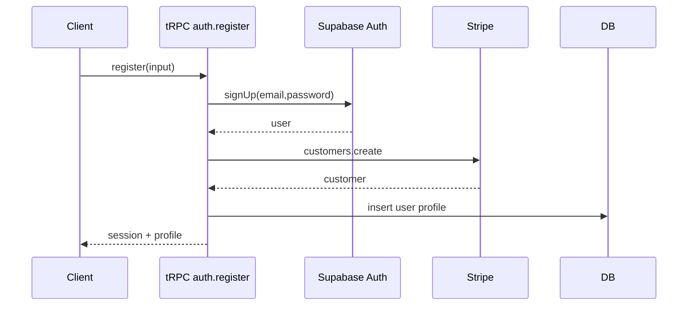

# Workflow: User Registration - Make the CHANGE

## Objective
Register a new user with dual billing choice, create Stripe customer, and initialize profile.

## Steps
1) Validate input (email/password/consents); check availability; rate limit.
2) Supabase `auth.signUp` with user metadata (level=basis, billingFrequency).
3) Create Stripe customer with metadata `{ userId, billingFrequency, source }`.
4) Create app profile row; issue session tokens.
5) Send welcome + verification email; track analytics `user_registered`.

## Failure Paths
- Email taken → return conflict.
- Stripe unavailable → create user but flag `billing_init_failed`; retry job.

## Security
- Password complexity; disposable email domain block; audit trail.

## Diagrams

