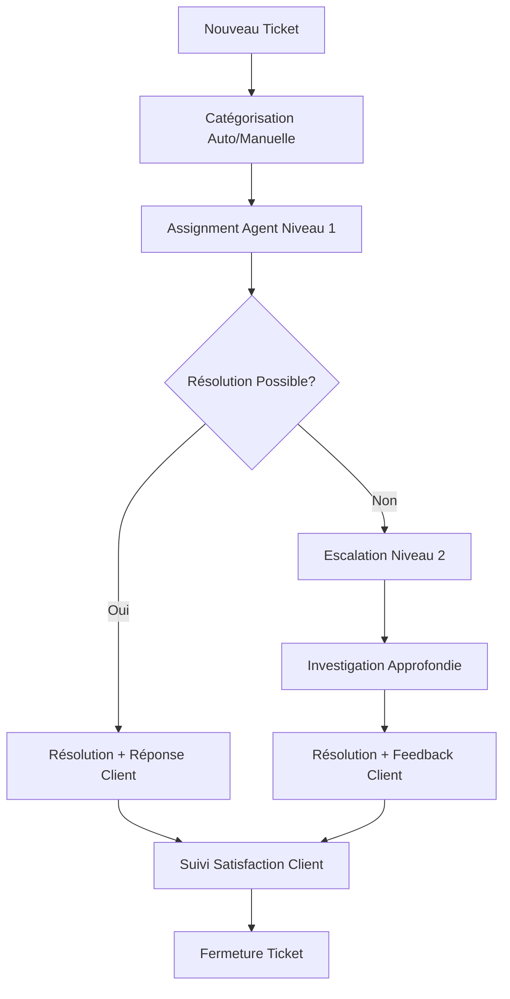

# Communication et Relation Client

**Stratégies et processus de communication avec les utilisateurs, gestion des réclamations et maintien de la satisfaction client.**

---

## 🎯 Vue d'Ensemble

Ce document définit les stratégies de communication client pour maintenir la transparence, gérer les attentes et assurer une expérience utilisateur premium dans l'écosystème "Invest-to-Earn" écologique.

---

## 📞 STRATÉGIE DE COMMUNICATION

### 🎨 Tone of Voice - Make the CHANGE

#### Personnalité de Marque

```yaml
Caractéristiques:
- Authentique et transparent
- Optimiste mais réaliste  
- Pédagogue et encourageant
- Proche de la nature
- Technologiquement savvy mais accessible

Éviter:
- Jargon technique complexe
- Promesses irréalistes
- Culpabilisation écologique
- Communication corporate froide
```

#### ✅ **DÉCISIONS FINALISÉES Tone of Voice**

- [x] **GUIDE** : Authentique, accessible, jamais prêcheur (voir design-system/foundations.md)
- [x] **ÉVITER** : Culpabilisation, greenwashing, jargon technique
- [x] **UTILISER** : "Contribution", "impact rewards", "récompenses écologiques"
- [x] **ADAPTATION** : Messages par persona (Claire dynamique, Marc précis, Fatima chaleureux)
- [x] **PRINCIPE** : "Grâce à vous" plutôt que "Il faut que"

### 📱 Canaux de Communication

#### Hiérarchie des Canaux

```yaml
Communication Proactive (Make the CHANGE → User):
1. Push notifications app (urgent, temps réel)
2. Email newsletters (hebdomadaire, éducatif)
3. SMS (critiques : livraison, problèmes)
4. In-app messages (contextuel, non-intrusif)

Communication Réactive (User → Make the CHANGE):
1. Chat support in-app (priorité)
2. Email support contact@makethechange.com
3. FAQ dynamique avec recherche
4. Communauté/forum (Phase 2)
```

#### ✅ **DÉCISIONS FINALISÉES Canaux Communication**

- [x] **OUTIL SUPPORT** : Crisp.chat (chat + email unifié, gratuit <2 agents)
- [x] **SLA RÉPONSE** : <2h chat, <24h email
- [x] **ESCALATION** : Chat→email→téléphone si nécessaire
- [x] **EMAIL MARKETING** : Brevo (ex-Sendinblue) pour rapport qualité/prix
- [x] **FEATURES** : Automation, segmentation, A/B testing intégrés
- [x] **HORAIRES** : Horaires bureau suffisants (9h-18h), pas 24/7 Phase 1

---

## 📧 COMMUNICATION PROACTIVE

### 🎯 Onboarding & Éducation

#### Séquence Onboarding Email (7 jours)

```yaml
Jour 0 (Inscription):
Sujet: "Bienvenue dans l'aventure Make the CHANGE !"
Contenu:
- Confirmation inscription
- Lien vérification email
- Next steps clairs

Jour 1:
Sujet: "Votre premier projet vous attend 🌱"
Contenu:
- Guide découverte projets

- Call-to-action premier investissement

Jour 3:
Sujet: "Comment vos points se transforment en récompenses"
Contenu:
- Explication économie de points
- Showcase produits populaires
- Témoignage client

Jour 7:
Sujet: "Votre impact environnemental compte"
Contenu:
- Éducation impact biodiversité
- Chiffres globaux plateforme
- Incitation partage réseau social
```

#### ✅ **DÉCISIONS FINALISÉES Onboarding**

- [x] **SÉQUENCE** : 5 emails sur 14 jours (J+1, J+3, J+7, J+10, J+14)
- [x] **DESIGN** : Templates Brevo + custom CSS cohérent branding
- [x] **SEGMENTATION** : Contenu adapté par persona automatiquement
- [x] **TRIGGER STOP** : Premier investissement arrête séquence onboarding
- [x] **A/B TESTING** : Tests variations sujets intégrés Brevo
- [x] **AUTOMATION** : Setup complet dans Brevo avec API intégration

### 📊 Communication Transparence & Impact

#### Newsletter Mensuelle "L'Impact en Chiffres"

```yaml
Structure Type:
1. Édito du mois (actualités partenaires, évolutions plateforme)
2. Métriques impact global (arbres plantés, ruches soutenues, CO2 économisé)
3. Spotlight partenaire du mois (HABEEBEE ou ILANGA NATURE)
4. Témoignage utilisateur/producteur
5. Nouveaux produits disponibles
6. Tips éco-responsables
```

#### Communications Critiques Transparence

```yaml
Situations Nécessitant Communication:
- Retard production partenaire
- Rupture stock produit populaire
- Problème qualité identifié
- Évolution économie de points
- Maintenance technique longue
- Nouvelles réglementations
```

#### TODO - Communication Transparence

- [ ] **CALENDAR** : Calendrier éditorial newsletters (sujets par mois)
- [ ] **METRICS** : Quelles métriques d'impact communiquer et comment les calculer
- [ ] **CRISIS COMM** : Templates communication de crise par scénario
- [ ] **APPROVAL** : Qui valide les communications sensibles ?
- [ ] **LEGAL** : Revue légale des communications d'impact (pas de greenwashing)

---

## 🎧 SUPPORT CLIENT RÉACTIF

### 📋 Types de Demandes Support

#### Catégorisation des Tickets

```typescript
enum SupportTicketType {
  // Compte & Authentification
  ACCOUNT_ACCESS = 'account_access',
  PASSWORD_RESET = 'password_reset',
  PROFILE_UPDATE = 'profile_update',
  
  // Investissements
  PAYMENT_FAILED = 'payment_failed',
  INVESTMENT_QUESTION = 'investment_question',
  POINTS_CALCULATION = 'points_calculation',
  
  // Commandes & Livraison
  ORDER_STATUS = 'order_status',
  SHIPPING_DELAY = 'shipping_delay',
  PRODUCT_QUALITY = 'product_quality',
  RETURN_REQUEST = 'return_request',
  
  // Technique
  APP_BUG = 'app_bug',
  FEATURE_REQUEST = 'feature_request',
  
  // Autres
  PARTNERSHIP_INQUIRY = 'partnership_inquiry',
  GENERAL_INFO = 'general_info'
}
```

#### ✅ **DÉCISIONS FINALISÉES Support Management**

- [x] **SLA DÉFINI** : P1 (2h), P2 (24h), P3 (72h) selon criticité
- [x] **FAQ INTÉGRÉE** : 20 articles couvrant 80% questions dans Crisp
- [x] **ESCALATION** : Automatique si pas de réponse dans délai SLA
- [x] **KNOWLEDGE BASE** : FAQ avec recherche intégrée + screenshots
- [x] **MACROS** : Templates réponses courantes dans Crisp
- [x] **METRICS CIBLES** : CSAT >85%, temps réponse <4h, résolution 1er contact >70%

### 🔧 Processus de Résolution

#### Workflow Standard Ticket Support



#### Scripts de Réponse Type

```yaml
Accusé Réception (Auto):
"Bonjour [PRÉNOM],
Merci pour votre message. Nous avons bien reçu votre demande et notre équipe vous répondra dans les [SLA] heures.
Votre numéro de ticket : #[TICKET_ID]
L'équipe Make the CHANGE"

Résolution Problème Technique:
"Bonjour [PRÉNOM],
Merci de nous avoir signalé ce problème. Notre équipe technique a identifié et corrigé le bug. Votre [FONCTION] devrait maintenant fonctionner normalement.
N'hésitez pas à nous recontacter si le problème persiste.
Cordialement, [AGENT]"
```

#### TODO - Processus Support

- [ ] **TRAINING** : Formation agents support sur produits/processus
- [ ] **SCRIPTS** : Finaliser tous les scripts de réponse par scénario
- [ ] **ESCALATION PATHS** : Définir qui escalade vers qui (dev, business, partenaires)
- [ ] **CUSTOMER SATISFACTION** : Processus mesure satisfaction post-résolution
- [ ] **FEEDBACK LOOP** : Comment intégrer feedback support dans amélioration produit

---

## 🚨 GESTION DES RÉCLAMATIONS

### ⚠️ Types de Réclamations Critiques

#### Problèmes Produits

```yaml
Scénarios Fréquents:
- Produit défectueux/périmé reçu
- Livraison endommagée
- Produit non conforme description
- Allergies/réactions non mentionnées
- Emballage non écologique

Processus Standard:
1. Accusé réception immédiat (< 2h)
2. Investigation avec partenaire producteur
3. Proposition solution (remplacement, remboursement points)
4. Suivi satisfaction post-résolution
5. Amélioration process si nécessaire
```

#### Problèmes Économie de Points

```yaml
Scénarios Complexes:
- Points non crédités après investissement
- Calcul bonus incorrect
- Points expirés prématurément
- Erreur débit points commande

Actions Immédiates:
- Vérification logs système
- Recalcul manuel si nécessaire
- Crédit points compensatoires
- Documentation incident pour dev
```

#### TODO - Gestion Réclamations

- [ ] **COMPENSATION RULES** : Règles de compensation automatique vs manuelle
- [ ] **BUDGET** : Budget dédié compensation réclamations
- [ ] **LEGAL** : Obligations légales (garanties, remboursements, délais)
- [ ] **PARTNER ACCOUNTABILITY** : Comment responsabiliser partenaires pour qualité
- [ ] **CONTINUOUS IMPROVEMENT** : Process amélioration continue basé sur réclamations

### 📊 Mesure Satisfaction Client

#### KPIs Support Client

```yaml
Métriques Essentielles:
- CSAT (Customer Satisfaction): > 85%
- Temps réponse moyen: < 4h
- Taux résolution premier contact: > 70%
- NPS (Net Promoter Score): > 50
- Volume tickets par utilisateur actif: < 0.1

Alertes Critiques:
- CSAT < 80% sur 7 jours
- Temps réponse > 8h moyen
- Spike volume tickets (+50% vs baseline)
```

#### TODO - Satisfaction Client

- [ ] **SURVEY TOOL** : Outil d'enquête satisfaction (TypeForm, SurveyMonkey, intégré ?)
- [ ] **BENCHMARKING** : Comparer KPIs avec standards e-commerce/fintech
- [ ] **REPORTING** : Dashboard temps réel métriques support
- [ ] **ACTION PLANS** : Plans d'action automatiques si KPIs dégradés
- [ ] **REWARDS** : Récompenser agents support performants

---

## 🎓 ÉDUCATION UTILISATEUR

### 📚 Contenu Éducatif

#### Sujets Prioritaires

```yaml
Biodiversité & Impact:
- Rôle des abeilles dans écosystème
- Impact changement climatique agriculture
- Agroforesterie durable
- Traçabilité produits bio

Économie Plateforme:
- Comment fonctionne modèle "Invest-to-Earn"
- Calcul retour sur investissement
- Gestion optimale portfolio points
- Maximisation récompenses

Utilisation Plateforme:
- Guide navigation app mobile
- Optimisation expérience utilisateur
- Nouveautés fonctionnalités
- Tips & tricks avancés
```

#### Formats Contenu

```yaml
Dans l'App:
- Tooltips contextuals
- Carousels éducatifs dashboard
- Notifications push éducatives
- Articles blog intégrés

Externes:
- Newsletter éducative bi-mensuelle
- Webinaires mensuels avec experts
- Guides PDF téléchargeables
- Vidéos explicatives YouTube (Phase 2)
```

#### TODO - Éducation Utilisateur

- [ ] **CONTENT CALENDAR** : Calendrier de production contenu éducatif
- [ ] **EXPERTS** : Identifier experts pour interviews/webinaires
- [ ] **PRODUCTION** : Qui crée le contenu ? (interne, freelance, partenaires)
- [ ] **DISTRIBUTION** : Canaux de distribution optimaux par type contenu
- [ ] **ENGAGEMENT** : Métriques engagement contenu éducatif
- [ ] **FEEDBACK** : Processus collecte feedback utilisateurs sur contenu

---

## 📱 COMMUNICATION IN-APP

### 💬 Messages Contextuels

#### Types Messages In-App

```typescript
interface InAppMessage {
  type: 'tooltip' | 'modal' | 'banner' | 'popup'
  trigger: 'first_visit' | 'feature_discovery' | 'inactivity' | 'milestone'
  priority: 'low' | 'medium' | 'high' | 'critical'
  dismissible: boolean
  frequency: 'once' | 'daily' | 'weekly' | 'on_trigger'
}
```

#### Exemples Messages Intelligents

```yaml
Premier Investissement:
Trigger: User visite projets sans avoir investi
Message: "🌱 Prêt à faire votre premier impact ? Découvrez les projets à partir de €150"
Type: Banner, non-intrusif

Points Près d'Expirer:
Trigger: Points expirent dans 30 jours
Message: "⏰ 120 points expirent bientôt ! Découvrez nos produits premium"
Type: Modal, priorité high

Milestone Atteint:
Trigger: User atteint 1000 points total
Message: "🎉 Félicitations ! Vous avez généré 1000 points pour la biodiversité"
Type: Popup célébration
```

#### TODO - Communication In-App

- [ ] **MESSAGE LOGIC** : Logique déclenchement messages par persona
- [ ] **FREQUENCY CAPPING** : Éviter spam messages (max X par jour)
- [ ] **A/B TESTING** : Tester variations messages pour optimiser engagement
- [ ] **ANALYTICS** : Tracker engagement, conversion, dismissal rates
- [ ] **PERSONALIZATION** : Personnaliser messages selon comportement utilisateur

### 🔔 Notifications Push Stratégiques

#### Stratégie Notifications

```yaml
Catégories:
1. Transactionnelles (confirmations, statuts) - Always On
2. Engagement (nouveautés, incitations) - Opt-in par défaut
3. Éducatives (tips, impact) - Opt-in explicite
4. Marketing (promos, events) - Opt-in explicite

Timing Optimal:
- Matin (9h-11h): Motivation, nouveautés
- Déjeuner (12h-14h): Contenu rapide, tips
- Soir (18h-20h): Récap journée, détente
```

#### TODO - Notifications Push

- [ ] **PERMISSION STRATEGY** : Stratégie demande permission push (timing, message)
- [ ] **SEGMENTATION** : Segmenter audiences pour messaging ciblé
- [ ] **FREQUENCY** : Fréquence optimale pour éviter unsubscribe
- [ ] **TESTING** : A/B test timing, contenu, fréquence
- [ ] **METRICS** : Open rates, click rates, unsubscribe rates par catégorie
- [ ] **COMPLIANCE** : Respect RGPD et réglementations notifications

---

## 📊 ANALYTICS & AMÉLIORATION CONTINUE

### 📈 Métriques Communication

#### KPIs Communication Globale

```yaml
Engagement:
- Taux ouverture emails: > 25%
- Taux clic emails: > 5%
- Engagement in-app messages: > 30%
- Retention notification push: > 80%

Satisfaction:
- Support CSAT: > 85%
- Response time < 4h
- Escalation rate < 15%
- Self-service resolution: > 40%

Impact Business:
- Conversion post-communication: +X%
- Lifetime value users engagés: +Y%
- Churn reduction: -Z%
```

#### TODO - Analytics Communication

- [ ] **TOOLS** : Outils analytics (Mixpanel, Amplitude, Google Analytics)
- [ ] **DASHBOARDS** : Dashboards temps réel métriques communication
- [ ] **ALERTS** : Alertes automatiques si métriques dégradées
- [ ] **REPORTING** : Reporting hebdo/mensuel pour équipe management
- [ ] **OPTIMIZATION** : Processus optimisation continue basé sur data

### 🔄 Feedback Loop Utilisateurs

#### Collecte Feedback

```yaml
Méthodes:
- Surveys in-app post-interaction
- Emails feedback post-support
- Reviews app stores
- Interviews utilisateurs qualitatives
- Beta testing nouveautés

Analyse:
- Sentiment analysis automatique
- Catégorisation feedback par thème
- Priorisation selon impact/fréquence
- Reporting équipe produit
```

#### TODO - Feedback Loop

- [ ] **COLLECTION TOOLS** : Outils collecte feedback (Hotjar, UserVoice, intégré)
- [ ] **ANALYSIS PROCESS** : Processus analyse et priorisation feedback
- [ ] **ACTION PLANNING** : Comment transformer feedback en actions concrètes
- [ ] **CLOSING LOOP** : Communiquer retour aux utilisateurs sur actions prises
- [ ] **INCENTIVES** : Inciter feedback avec récompenses points/produits

---

*Document créé le 21 août 2025 - Version 1.0*
*TODO: Finaliser toutes les sections marquées TODO avant lancement MVP*
