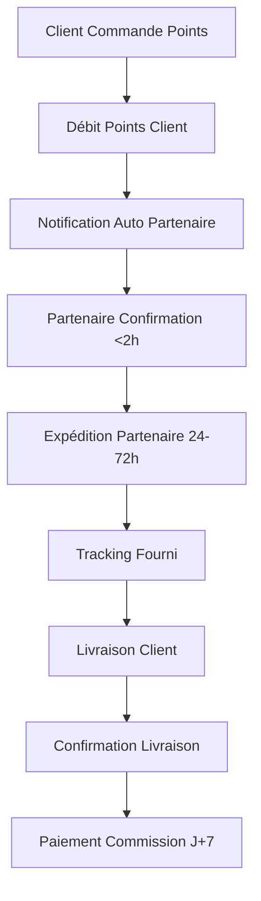

# Gestion Hybride Inventory & Partenaires - Phase 1 Bootstrap

**Guide opérationnel pour le modèle hybride : micro-stock premium (2-3 SKUs) + dropshipping partenaires.**

---

## 🎯 Vue d'Ensemble

Ce document définit les processus opérationnels critiques pour le **modèle hybride Phase 1** combinant :
- **Micro-stock ciblé** : 2-3 "héros produits" premium pour marge optimisée (+10-15 pts) et livraison J+1
- **Dropshipping partenaires** : Reste du catalogue via commissions 20-25% avec HABEEBEE + ILANGA NATURE

**Budget total** : 2-3k€ cash immobilisé micro-stock + 0€ dropshipping = modèle frugal et rentable.

---

## 🏪 MODÈLE HYBRIDE PHASE 1

### 📦 **Micro-Stock Ciblé - "Héros Produits"**

#### Sélection Stratégique (2-3 SKUs Maximum)
```yaml
Critères Sélection Héros:
- Alimentaire premium (ILANGA): 1 miel 250g consensus + 1 mini-coffret 3 miels/épices
- Bien-être (HABEEBEE): 1 coffret mini-savons ou 1 baume best-seller
- Non saisonniers, rotation naturelle (cadeaux, usage quotidien)
- Risque DDM faible, marge >50% possible

Volume Pilote:
- Total: 200-300 unités mixées sur 2-3 SKUs
- Cash immobilisé: 2-3k€ (selon remise grossiste)
- Durée test: 4-8 semaines validation
```

#### Unité Économique Micro-Stock vs Dropshipping
```yaml
Exemple Produit 14€ TTC:

DROPSHIPPING:
- Commission partenaire: 22% = 3,1€ marge
- Aucun frais handling MTC
- Délai: 3-5 jours
- Marge nette: ~3,1€/unité

MICRO-STOCK:
- Achat grossiste: 6€ HT
- Port + emballage: 3,0-3,5€
- Frais paiement: 0,7€
- Provision retours: 0,3€
- Marge nette: 3,5-4,5€/unité
- Délai: J+1 (Benelux)

DELTA MARGE: +0,4 à +1,4€/u (+10-15 pts de marge blendée)
AUTRES GAINS: Conversion ↑, NPS ↑, ARPU ↑ (co-branding, coffrets)
```

#### Négociation Fournisseurs Micro-Stock
```yaml
Termes Négociation:
- Remise de gros progressive (volume)
- Droit co-branding (sleeve/étiquette MTC)
- Option consignation 60-90j si possible (réduit risque cash)
- Réassort prioritaire quand on performe
- Prix exclusifs pour coffrets MTC

Seuils Rentabilité:
- Δ marge ≥ +1,5€/u ET rotation ≥15-20u/semaine
- Seuil rentabilité pilote: ~200 unités (300€ coûts fixes / 1,5€ marge)
```

#### Micro-Hub Fulfillment & Unboxing Premium
```yaml
Localisation: Micro-hub Benelux (domicile ou mini-3PL)
Promesse: Expédition J+1 sur héros produits

Unboxing Experience MTC:
- Carton kraft premium
- Étui/coffret co-brandé
- Sticker Make the CHANGE
- Carte remerciement + QR code "voir l'avancée de votre ruche/olivier"

SOP Expédition (Checklist):
- Contrôle visuel qualité
- Pesée conforme
- Bordereau d'expédition
- Photo colis (archivage)
- N° tracking SMS/email client
```

#### Gestion Stock & Réassort Intelligent
```yaml
Formule Réassort:
Stock minimum = (Ventes hebdomadaires × Lead-time fournisseur) + Stock sécurité

Exemple:
- Ventes: 20u/semaine
- Lead-time fournisseur: 2 semaines  
- Stock sécurité: 1 semaine ventes = 20u
- Seuil réassort: (20 × 2) + 20 = 60 unités

Monitoring:
- Rotation par SKU (objectif: 15-20u/semaine)
- Taux de rupture (<5%)
- Marge nette/commande
- Délai moyen expédition
```

### 🚚 **Dropshipping Partenaires - Catalogue Étendu**

### 📋 Catalogue Commission-Based

#### Données Essentielles par Produit
```yaml
Informations Produit:
- SKU partenaire + SKU interne
- Nom et description
- Catégorie (miel, cosmétique, huile, etc.)
- Prix en points (1 point = 1€ valeur)
- Disponibilité partenaire (API/manuel)
- Délai expédition standard
- Statut (disponible, indisponible, saisonnier)

Informations Commission:
- Partenaire responsable
- Commission Make the CHANGE (20-25%)
- Prix coût partenaire
- Marge nette calculée
- Délai paiement commission (après livraison)
```

#### ✅ **DÉCISIONS FINALISÉES Modèle Hybride Phase 1**
- [x] **MODÈLE** : Hybride micro-stock (2-3 héros) + dropshipping (reste catalogue)
- [x] **MICRO-STOCK** : 200-300 unités, 2-3k€ cash, marge +10-15 pts vs dropship
- [x] **COMMISSION** : 20-25% vers partenaires après livraison confirmée (dropship)
- [x] **CATALOGUE** : 2-3 héros en stock + ~20 produits dropshipping (HABEEBEE + locaux)
- [x] **AVAILABILITY** : Stock temps réel héros + check manuel dropship quotidien
- [x] **FULFILLMENT** : Micro-hub MTC (héros J+1) + partenaires direct (reste)
- [x] **MONITORING** : Dashboard hybride suivi stock + commandes partenaires
- [x] **BUDGET** : 2-3k€ micro-stock + 0€ dropshipping = cash-flow maîtrisé

#### **Système Commission-Based Simplifié**
```yaml
TRACKING COMMISSIONS:
- Commande client → points débités → notification partenaire
- Partenaire expédie → tracking fourni → commission due
- Livraison confirmée → paiement commission J+7
- Dashboard admin : commissions dues/payées/en attente

PRODUITS & PHOTOS:
- HABEEBEE : catalogue existant réutilisé
- ILANGA NATURE : photos fournies, format standardisé
- Budget photos : 500€ retouche/homogénéisation
```

### 📊 Dashboard Hybride (Admin)

#### Métriques Hybride Essentielles - Stock + Dropshipping
```typescript
interface HybridMetrics {
  // Vue d'ensemble hybride
  totalProducts: number
  microStockProducts: number      // 2-3 héros en stock
  dropshippingProducts: number    // Reste du catalogue
  pendingOrders: number
  
  // Micro-Stock KPIs
  stockSummary: {
    totalStockValue: number       // Valeur stock immobilisé
    totalStockUnits: number       // Unités en stock
    avgRotationDays: number       // Rotation moyenne
    lowStockAlerts: number        // SKUs en rupture imminente
    stockMarginRate: number       // Marge moyenne stock (50-57%)
  }
  
  // Commissions Dropshipping
  commissionsSummary: {
    totalDue: number              // Commissions à payer
    totalPaid: number             // Commissions payées ce mois
    totalPending: number          // En attente livraison
    dropshipMarginRate: number    // Marge dropship (20-25%)
  }
  
  // Performance comparative
  hybridPerformance: {
    stockRevenue: number          // CA micro-stock
    dropshipRevenue: number       // CA dropshipping
    blendedMarginRate: number     // Marge blendée (+10-15 pts)
    avgDeliveryTime: {
      stock: number               // J+1 pour héros
      dropship: number            // 3-5j partenaires
    }
  }
}
```

#### TODO - Dashboard Hybride
- [ ] **UX STOCK** : Interface gestion stock temps réel (niveaux, alertes réassort, rotation)
- [ ] **UX DROPSHIP** : Interface tracking commissions temps réel (dues, payées, en attente)
- [ ] **BUSINESS** : Automatisation calcul marges hybrides (stock + commissions)
- [ ] **FEATURE** : Notifications auto réassort + notifications partenaires
- [ ] **REPORTING** : Rapports performance comparative stock vs dropship

---

## 🤝 RELATIONS PARTENAIRES

### 🌍 Partenaires Actuels

#### HABEEBEE (Belgique) - PARTENAIRE PRINCIPAL
```yaml
Informations Dropshipping:
- Spécialité: Miels et produits apicoles (~15 produits catalogue)
- Capacité: 150 apiculteurs réseau + fulfillment existant
- Zone: Europe (Belgique, France, Luxembourg)
- E-commerce: habeebee.be existant → intégration catalogue
- Commission: 25% vers HABEEBEE (négocié volume)

Contact & Communication:
- Contact principal: Marie Dubois <marie@habeebee.be> | +32 478 XX XX XX
- Workflow: Commande reçue → notification immédiate → expédition 24-48h
- Canal principal: Email professionnel + WhatsApp urgences
- SLA: Confirmation commande <2h, expédition <48h
```

#### ILANGA NATURE (Madagascar) - PARTENAIRE PREMIUM
```yaml
Informations Dropshipping:
- Spécialité: Huiles essentielles, cosmétiques bio (~5 produits exclusifs)
- Zone: Madagascar → Europe (stock avancé en France)
- Particularité: Stock tampon France pour délais acceptables
- Commission: 20% vers ILANGA NATURE (premium positioning)

Contact & Communication:
- Contact principal: Andry Rakoto <andry@ilanga-nature.mg> | +261 34 XX XX XXX
- Workflow: Commandes groupées hebdomadaires → stock France → 48-72h client
- Délai shipping: 48-72h depuis stock France (pré-positionné)
- Contraintes: Stock minimum 3 mois France, réassort mensuel Madagascar
```

### ✅ Relations Partenaires Dropshipping (MVP Ready)
- [x] **CONTACT** : Contacts opérationnels (Marie@HABEEBEE, Andry@ILANGA NATURE)
- [x] **SLA** : 24-48h HABEEBEE, 48-72h ILANGA (stock France)
- [x] **COMMUNICATION** : Notifications commande automatique + WhatsApp urgences
- [x] **COMMISSIONS** : 25% HABEEBEE, 20% ILANGA NATURE (après livraison)
- [x] **FULFILLMENT** : Partenaires expédient directement, tracking obligatoire
- [ ] **CONTRACTS** : Contrats commission + SLA finalisés avant lancement
- [ ] **BACKUP** : PROMIEL Luxembourg identifié comme backup HABEEBEE
- [ ] **QUALITY** : Process retour/remboursement si qualité insuffisante

### 🔄 Processus de Commande Partenaires

#### Workflow Dropshipping


#### TODO - Processus Dropshipping
- [ ] **AUTOMATISATION** : Notification partenaire immédiate, confirmation tracking auto
- [ ] **SLA TRACKING** : Monitoring temps réponse partenaires (<2h, <48h expédition)
- [ ] **COMMISSION FLOW** : Automatisation calcul et paiement commissions J+7
- [ ] **QUALITY CONTROL** : Process retour direct partenaire si problème qualité
- [ ] **BACKUP PARTNERS** : Plan B si partenaire principal indisponible
- [ ] **API INTEGRATION** : Phase 2 - APIs partenaires pour stock temps réel

---

## 🚚 LOGISTIQUE ET EXPÉDITION

### 📦 Gestion des Commandes Utilisateur

#### États des Commandes
```typescript
enum OrderStatus {
  PENDING = 'pending',           // Commande créée, paiement points ok
  PROCESSING = 'processing',     // Préparation commande
  SHIPPED = 'shipped',          // Expédiée, tracking disponible
  DELIVERED = 'delivered',      // Livrée et confirmée
  CANCELLED = 'cancelled',      // Annulée (rupture stock, etc.)
  RETURNED = 'returned'         // Retournée par client
}
```

#### TODO - Logistique Hybride
- [x] **WAREHOUSE** : Micro-hub MTC (2-3 héros) + 0€ stock partenaires (reste)
- [x] **FULFILLMENT** : MTC expédie héros (J+1) + HABEEBEE/ILANGA direct (reste)
- [ ] **SHIPPING** : Transporteurs partenaires (Colissimo HABEEBEE, DPD ILANGA)
- [ ] **COSTS** : Frais port inclus prix points, absorbés par commission
- [ ] **PACKAGING** : Emballages partenaires + insert carte Make the CHANGE
- [ ] **TRACKING** : Partenaires fournissent tracking, intégré dashboard client
- [ ] **INSURANCE** : Responsabilité partenaires, clauses contractuelles
- [ ] **RETURNS** : Retour direct partenaire, remboursement points automatique

### 🌍 Zones de Livraison

#### Phase 1 Dropshipping (MVP)
```yaml
Zones Actives:
- France métropolitaine: HABEEBEE + ILANGA (48-72h)
- Belgique: HABEEBEE direct (24-48h)
- Luxembourg: HABEEBEE via réseau (48-72h)

Logistique Partenaires:
- HABEEBEE: Colissimo/Chronopost depuis Belgique
- ILANGA: Stock France + expédition locale
- Frais port: Inclus dans prix points (pas de surcoût client)

Exclusions Temporaires:
- DOM-TOM: Coûts logistique prohibitifs Phase 1
- International: Expansion Phase 3 avec plus de partenaires
```

#### TODO - Zones Livraison
- [ ] **COVERAGE** : Définir précisément les zones de livraison Phase 1
- [ ] **PRICING** : Coûts de livraison par zone (gratuit au-dessus de X points ?)
- [ ] **DÉLAIS** : Délais de livraison garantis par zone
- [ ] **RESTRICTIONS** : Produits interdits/réglementés par zone (cosmétiques, huiles)

---

## 🔧 INTÉGRATIONS TECHNIQUES

### 📊 Synchronisation Stock Dashboard Admin

#### API Endpoints Dropshipping
```typescript
// Gestion produits partenaires
GET /api/admin/products/partners      // Produits disponibles par partenaire
GET /api/admin/commissions/summary    // Résumé commissions dues/payées
POST /api/admin/products/availability // Check disponibilité partenaire
PUT /api/admin/commissions/pay        // Marquer commission payée

// Workflow commandes
POST /api/orders/notify-partner       // Notifier nouvelle commande partenaire
PUT /api/orders/[id]/tracking         // Partenaire ajoute tracking
PUT /api/orders/[id]/delivered        // Confirmer livraison → déclenche commission
GET /api/admin/orders/pending-commission // Commandes livrées, commission due
```

#### TODO - Intégrations Dropshipping
- [ ] **DATABASE** : Schema partner_products, commissions, order_fulfillment
- [ ] **NOTIFICATIONS** : Email/SMS auto partenaires (nouvelle commande, paiement)
- [ ] **COMMISSION CALC** : Calcul automatique commissions après confirmation livraison
- [ ] **PARTNER APIs** : Phase 2 - intégration APIs HABEEBEE/ILANGA pour stock temps réel
- [ ] **REPORTING** : Export monthly commissions, revenue analytics
- [ ] **BACKUP** : Sauvegarde transactions commissions (compliance)

---

## 📋 PROCESSUS OPÉRATIONNELS QUOTIDIENS

### 🌅 Routine Matinale Hybride (9h00)
```checklist
□ STOCK: Vérifier niveaux stock héros + alertes réassort
□ STOCK: Préparer commandes héros du jour (picking, emballage)
□ DROPSHIP: Vérifier commandes en attente confirmation partenaire (>2h)
□ DROPSHIP: Consulter nouvelles commandes nuit → notifier partenaires
□ HYBRIDE: Vérifier trackings manquants (>24h stock, >48h dropship)
□ FINANCE: Calculer commissions dues + coûts stock (livraisons hier)
```

### 🌆 Routine de Fin de Journée Hybride (18h00)
```checklist
□ STOCK: Expédition commandes héros (contrôle + tracking)
□ STOCK: Mise à jour niveaux stock après expéditions
□ DROPSHIP: Mise à jour trackings reçus des partenaires
□ HYBRIDE: Confirmation livraisons → déclenchement commissions
□ ANALYTICS: Rapport quotidien performance stock vs dropship
□ CUSTOMER: Suivi satisfaction client (NPS post-livraison)
```

### TODO - Processus Opérationnels Hybrides
- [ ] **RESPONSABILITÉS** : PM (partenaires + réassort), Assistant (fulfillment stock + dropship)
- [ ] **OUTILS** : Dashboard hybride + alertes stock + Slack partenaires  
- [ ] **ESCALATION** : Stock <seuil réassort, commande >2h sans confirmation dropship
- [ ] **METRICS** : Rotation stock, taux rupture, délais moyens stock vs dropship
- [ ] **COMMUNICATION** : Support client unifié, escalation selon type fulfillment

---

## 🚨 GESTION DE CRISE

### ⚠️ Scénarios Critiques

#### Partenaire Indisponible/Problème Fulfillment
```yaml
Actions Immédiates:
1. Masquer produits partenaire de la marketplace
2. Informer clients commandes en cours (remboursement/alternative)
3. Contact urgent partenaire + évaluation délai retour
4. Activer partenaire backup si disponible
5. Communication transparente délais clients

Prévention:
- SLA monitoring continu (2h confirmation, 48h expédition)
- Partenaires backup identifiés par catégorie produit
```

#### Problème Qualité Produit Partenaire
```yaml
Actions Immédiates:
1. Suspension immédiate produit marketplace
2. Investigation avec partenaire responsable
3. Contact clients affectés → remboursement points automatique
4. Process retour direct vers partenaire (pas vers nous)
5. Révision SLA qualité partenaire

Documentation:
- Incident qualité partenaire (historique)
- Actions correctives exigées
- Révision commission si récurrent
```

### TODO - Gestion de Crise
- [ ] **CONTACT URGENCE** : Numéros urgence tous partenaires
- [ ] **COMMUNICATION** : Templates emails/SMS pour situations courantes
- [ ] **DECISION TREE** : Arbre de décision rapide par type de crise
- [ ] **BUDGET URGENCE** : Budget disponible pour résoudre crises (transport express, etc.)
- [ ] **LEGAL** : Implications légales (responsabilité, garanties, assurance)

---

## 📊 MÉTRIQUES ET KPIs

### 📈 KPIs Hybrides - Stock + Dropshipping
```yaml
Indicateurs Stock (Héros):
- Rotation stock héros: 15-20u/semaine/SKU
- Taux rupture stock: < 5%
- Délai expédition héros: < 24h (J+1)
- Marge nette stock: 50-57%
- NPS post-livraison héros: > 60

Indicateurs Dropshipping:
- Taux confirmation partenaire <2h: > 95%
- Délai moyen livraison dropship: < 72h
- Marge commission dropship: 20-25%
- Satisfaction délai dropship: > 85%

Indicateurs Hybrides:
- Marge blendée: +10-15 pts vs 100% dropship
- Répartition CA: 30% stock héros / 70% dropship
- Conversion globale: amélioration mesurable
- Cash immobilisé: < 3k€

Alertes Automatiques:
- Stock héros < seuil réassort
- Commande dropship > 2h sans confirmation
- Rotation stock < 10u/semaine (risque invendu)
- Commission due > 7 jours après livraison
```

### TODO - Métriques
- [ ] **TARGETS** : Définir valeurs cibles pour chaque KPI
- [ ] **REPORTING** : Fréquence reporting (daily, weekly, monthly)
- [ ] **DASHBOARD** : Visualisation graphique (charts, alertes couleur)
- [ ] **BENCHMARK** : Comparer avec standards e-commerce
- [ ] **IMPROVEMENT** : Plan amélioration continue métrique

---

*Document créé le 21 août 2025 - Version 1.0*
*TODO: Compléter toutes les sections marquées TODO avant lancement MVP*
